# Small Software Cloud - Master Execution Graph

This document is the master dependency graph for the project.

A downstream critical node does not begin simply because the previous node is mostly complete. Gates exist to protect reliability, security, performance, and product quality.

## Master graph

```mermaid
flowchart TD
A[01 Product Thesis + Whitepaper] --> G1{GATE 1: Thesis Frozen}
G1 --> B[02 V1 System Specification]
B --> C[03 Architecture Spike]
B --> D[04 Security Architecture]
B --> E[05 Reliability + Performance Architecture]
C --> G2{GATE 2: Architecture Proven}
D --> G2
E --> G2
G2 --> F[06 Control Plane Foundation]
F --> F1[Accounts + Workspaces]
F --> F2[Application Model]
F --> F3[Deployment State Machine]
F --> F4[Infrastructure Adapter Interfaces]
F --> F5[Audit + Event Model]
F1 --> G3{GATE 3: Control Plane Stable}
F2 --> G3
F3 --> G3
F4 --> G3
F5 --> G3
G3 --> H[07 GitHub Integration]
H --> H1[GitHub App]
H --> H2[Repository Selection]
H --> H3[Commit + Branch Metadata]
H --> H4[Webhook Pipeline]
H1 --> G4{GATE 4: Source Pipeline Reliable}
H2 --> G4
H3 --> G4
H4 --> G4
G4 --> I[08 Application Analyzer]
I --> I1[Framework Detection]
I --> I2[Node + Package Manager Detection]
I --> I3[Build Detection]
I --> I4[Environment Variable Detection]
I --> I5[Database Requirement Detection]
I --> I6[Compatibility Verdict]
I1 --> G5{GATE 5: Analyzer Deterministic}
I2 --> G5
I3 --> G5
I4 --> G5
I5 --> G5
I6 --> G5
G5 --> J[09 Secrets + Configuration]
J --> J1[Encrypted Secret Storage]
J --> J2[Environment Management]
J --> J3[Existing Database Mode]
J --> J4[Provisioned PostgreSQL Mode]
J1 --> G6{GATE 6: Configuration Secure}
J2 --> G6
J3 --> G6
J4 --> G6
G6 --> K[10 Deployment Orchestrator]
K --> K1[Provision Resources]
K --> K2[Create Runtime]
K --> K3[Inject Configuration]
K --> K4[Build]
K --> K5[Deploy]
K --> K6[Verify]
K --> K7[Publish HTTPS URL]
K1 --> G7{GATE 7: Deployment Repeatable}
K2 --> G7
K3 --> G7
K4 --> G7
K5 --> G7
K6 --> G7
K7 --> G7
G7 --> L[11 Logs + Failure Recovery]
L --> L1[Build Logs]
L --> L2[Runtime Logs]
L --> L3[Deployment Events]
L --> L4[Retries + Idempotency]
L --> L5[Failed Resource Cleanup]
L1 --> G8{GATE 8: Failures Explainable}
L2 --> G8
L3 --> G8
L4 --> G8
L5 --> G8
G8 --> M[12 DealUp Website Deployment]
M --> G9{GATE 9: Simple Workload Proven}
G9 --> N[13 DealOS Deployment]
N --> G10{GATE 10: Business App Proven}
G10 --> O[14 Vantage Deployment]
O --> G11{GATE 11: Complex Workload Proven}
G11 --> P[15 Security Hardening]
G11 --> Q[16 Reliability Hardening]
G11 --> R[17 Performance Hardening]
G11 --> S[18 Backup + Recovery Testing]
P --> G12{GATE 12: External Alpha Ready}
Q --> G12
R --> G12
S --> G12
G12 --> T[19 Additional Internal/Test Apps]
T --> U[20 External Alpha App 1]
U --> V[21 External Apps 2-5]
V --> G13{GATE 13: External Reliability Proven}
G13 --> W[22 Usage Metering]
G13 --> X[23 Cost Accounting]
G13 --> Y[24 Billing]
W --> G14{GATE 14: Economics Proven}
X --> G14
Y --> G14
G14 --> Z[25 External Apps 6-10]
Z --> G15{GATE 15: Paid Beta Ready}
G15 --> AA[26 Distribution Layer]
AA --> AA1[GitHub Deploy Flow]
AA --> AA2[CLI]
AA --> AA3[REST API]
AA --> AA4[Agency Workflow]
AA1 --> AB[27 Public Beta]
AA2 --> AB
AA3 --> AB
AA4 --> AB
AB --> AC[28 MCP + Agent Integrations]
AC --> AD[29 Infrastructure Expansion - only if economics justify]
```



## Permanent parallel tracks

Security, reliability, economics, and real-workload validation are continuous tracks rather than late-stage cleanup phases.

```text
MAIN PRODUCT GRAPH
       |
       +-- SECURITY TRACK
       |     threat modelling
       |     isolation testing
       |     secret audits
       |     abuse controls
       |     access reviews
       |
       +-- RELIABILITY TRACK
       |     repeatability testing
       |     failure injection
       |     recovery testing
       |     latency testing
       |     availability
       |
       +-- ECONOMICS TRACK
       |     provider cost
       |     cost per workload
       |     gross margin
       |     usage measurement
       |     pricing
       |
       +-- VALIDATION TRACK
             DealUp
                -> DealOS
                -> Vantage
                -> Test Apps
                -> External Apps
                -> Paying Apps
```

## Gate philosophy

A gate is passed only through evidence. Completion of implementation is not sufficient.

### Gate 1 - Thesis Frozen

Required evidence:
- problem statement is clear
- target customer is clear
- V1 boundary is explicit
- non-goals are explicit
- operating principles are documented
- whitepaper accepted as project baseline

### Gate 2 - Architecture Proven

Required evidence:
- V1 architecture documented
- provider assumptions validated through spikes
- security model reviewed
- workload/control-plane separation established
- performance model documented
- expected V1 infrastructure cost remains compatible with bootstrap constraints

### Gate 3 - Control Plane Stable

Required evidence:
- organisation/application/deployment models tested
- deployment state transitions are explicit
- events are auditable
- infrastructure provider interfaces are abstracted
- failure cannot silently corrupt control-plane state

### Gate 4 - Source Pipeline Reliable

Required evidence:
- GitHub installation works with least privilege
- repository selection works
- branch and commit identity are preserved
- webhook delivery is authenticated
- duplicate webhook delivery is safe

### Gate 5 - Analyzer Deterministic

Required evidence:
- supported frameworks detected consistently
- unsupported workloads rejected clearly
- required configuration detected
- compatibility result is explainable
- AI is not required for critical deterministic decisions

### Gate 6 - Configuration Secure

Required evidence:
- secrets encrypted
- secrets never written into repositories
- access to secrets is least privilege
- existing database mode works
- provisioned PostgreSQL mode works
- deletion removes or revokes credentials correctly

### Gate 7 - Deployment Repeatable

Required evidence:
- same supported application can be deployed repeatedly
- no manual provider intervention required
- no duplicate resources created
- secrets injected correctly
- retries are safe
- HTTPS works
- verification succeeds
- redeployment works
- deletion cleans up owned resources

### Gate 8 - Failures Explainable

Required evidence:
- build failures visible
- runtime failures visible where provider capability allows
- deployment events preserved
- interrupted operations recover safely
- orphan resource detection exists
- user receives actionable failure information

### Gates 9-11 - Real Workload Proof

DealUp, DealOS, and Vantage must remain ordinary applications. No hidden platform-specific modifications may be introduced solely to make them deploy.

Each workload must be operated through the same supported path intended for external customers.

### Gate 12 - External Alpha Ready

External code must not be accepted before this gate.

Security requirements:
- customer workload separated from control plane
- tenant boundaries verified
- secrets encrypted
- least-privilege credentials
- resource limits enforced by underlying infrastructure
- safe deletion verified
- security review completed

Reliability requirements:
- repeatable deployment tests
- failed operations recover safely
- provider failures do not corrupt control-plane state
- retries are idempotent
- state-machine integrity tested

Performance requirements:
- control plane responsive
- no unnecessary runtime proxy
- platform-added workload latency negligible
- slow infrastructure operations asynchronous

Operational requirements:
- deployment logs available
- runtime failures visible where feasible
- audit trail complete
- infrastructure resources traceable
- emergency disable/delete mechanism works

Recovery requirements:
- backup process tested where platform owns backup responsibility
- restore process tested
- control-plane recovery tested

### Gate 13 - External Reliability Proven

Required evidence:
- multiple independently created applications deployed
- failure patterns understood
- no repeated manual infrastructure intervention
- support burden measured
- compatibility boundary remains credible

### Gate 14 - Economics Proven

Required evidence:
- usage measurable
- infrastructure cost attributable to workload
- pricing model tested
- gross-margin path credible
- billing reliable

### Gate 15 - Paid Beta Ready

Required evidence:
- reliability targets appropriate for beta achieved
- support process exists
- billing works
- recovery procedures documented
- external users can complete normal deployment without founder intervention

## Internal engineering targets

These are engineering ambitions, not public SLA promises for V1.

| Measure | Target direction |
| --- | --- |
| Supported deployment success rate | >99% as the platform matures |
| Control-plane availability | >=99.9% target before serious production scale |
| Configuration loss | Zero tolerated |
| Cross-tenant exposure | Zero tolerated |
| Secret leakage | Zero tolerated |
| Unsafe retry behaviour | Zero tolerated |
| Ambiguous deployment state | Zero tolerated |
| Unnecessary platform runtime hops | Zero wherever possible |
| Orphan resources | Effectively zero, with detection and reconciliation |

## Non-negotiable principle

Quality gates are allowed to delay the roadmap.

The roadmap is not allowed to weaken the quality gates.
