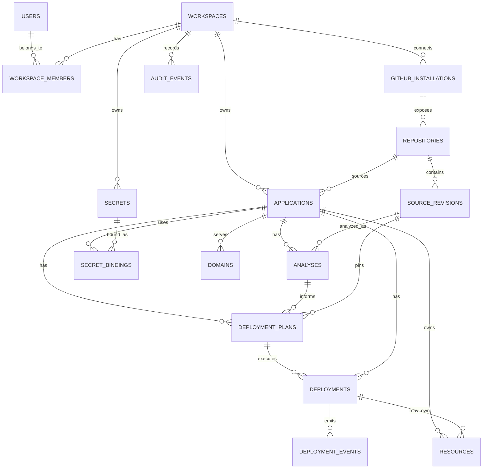

# Node 02 - V1 Control Plane Data Model

## Purpose

This document defines the canonical V1 data model for the Small Software Cloud control plane.

The model is designed to preserve four things above all else:

1. tenant ownership
2. deployment reproducibility
3. infrastructure traceability
4. recoverability after partial failure

The guiding rule is:

> The control-plane database is the canonical record of ownership, intent, and lifecycle.

## Relationship overview

```text
User
  -> Workspace
      -> Workspace Member
      -> GitHub Installation
      -> Repository
      -> Application
          -> Analysis
          -> Secret Metadata / Bindings
          -> Deployment Plan
              -> Deployment
                  -> Deployment Event
                  -> Provider Deployment Resource
          -> Provider Resource
          -> Domain
          -> Audit Event
```

A more explicit relationship view:

```text
WORKSPACE
  1 -> many APPLICATIONS
  1 -> many MEMBERS
  1 -> many GITHUB INSTALLATIONS
  1 -> many AUDIT EVENTS

APPLICATION
  1 -> many ANALYSES
  1 -> many DEPLOYMENT PLANS
  1 -> many DEPLOYMENTS
  1 -> many RESOURCES
  1 -> many SECRET BINDINGS
  1 -> many DOMAINS

DEPLOYMENT
  1 -> many DEPLOYMENT EVENTS
  1 -> many DEPLOYMENT-SCOPED RESOURCES
```

## Identity and tenancy

### users

Represents a human identity authenticated to the control plane.

Minimum fields:

```text
id
email
name
status
created_at
updated_at
```

Notes:
- V1 can support one authentication provider initially.
- Product authorization must not depend on email address alone.

### workspaces

Top-level tenant boundary.

Minimum fields:

```text
id
name
slug
status
created_at
updated_at
deleted_at
```

Every customer-owned application, secret, resource, deployment, and audit event must resolve to a workspace.

### workspace_members

Maps users to workspaces.

Minimum fields:

```text
id
workspace_id
user_id
role
status
created_at
```

V1 roles can remain deliberately small:

```text
OWNER
MEMBER
```

More granular permissions can be added later.

Constraint:

```text
UNIQUE(workspace_id, user_id)
```

## GitHub entities

### github_installations

Represents a GitHub App installation connected to a workspace.

Minimum fields:

```text
id
workspace_id
provider_installation_id
provider_account_id
provider_account_login
provider_account_type
status
created_at
updated_at
```

Do not store installation access tokens as long-lived plaintext.

### repositories

Represents a GitHub repository known to the platform.

Minimum fields:

```text
id
workspace_id
github_installation_id
provider_repository_id
owner_login
name
full_name
default_branch
is_private
status
created_at
updated_at
```

Constraint:

```text
UNIQUE(github_installation_id, provider_repository_id)
```

The repository record is metadata. Source code remains in GitHub.

## Application entities

### applications

Represents a long-lived software application operated by the platform.

Minimum fields:

```text
id
workspace_id
repository_id
name
slug
production_branch
runtime_profile
database_mode
status
current_live_deployment_id
created_at
updated_at
deleted_at
```

Possible status values:

```text
ACTIVE
DELETING
DELETED
SUSPENDED
```

`current_live_deployment_id` may be null before the first successful deployment.

Constraint:

```text
UNIQUE(workspace_id, slug)
```

### source_revisions

Represents an immutable Git commit used for analysis/deployment.

Minimum fields:

```text
id
repository_id
commit_sha
branch
commit_message
committed_at
created_at
```

Constraint:

```text
UNIQUE(repository_id, commit_sha)
```

A deployment must reference a source revision rather than only a branch name.

## Analysis entities

### analyses

Represents deterministic analyzer output for one application/source revision.

Minimum fields:

```text
id
application_id
source_revision_id
analyzer_version
status
detected_framework
detected_runtime
detected_package_manager
install_command
build_command
database_requirement
compatibility_status
compatibility_reasons_json
required_environment_variables_json
evidence_json
created_at
completed_at
```

Possible status values:

```text
PENDING
RUNNING
COMPLETED
FAILED
```

Possible compatibility values:

```text
SUPPORTED
NEEDS_CONFIGURATION
UNSUPPORTED
```

Analyzer output must be persisted so the same deployment attempt is not based on moving analysis logic.

## Configuration entities

### application_variables

Stores metadata for non-secret configuration and references for secret configuration.

Minimum fields:

```text
id
workspace_id
application_id
environment
key
value_type
is_required
source
created_at
updated_at
```

Example `value_type`:

```text
PLAIN
SECRET
MANAGED
```

Example `source`:

```text
USER
ANALYZER
PLATFORM
DATABASE_RESOURCE
```

For `SECRET`, plaintext value must not be stored in this table.

### secrets

Stores encrypted secret material or references to an external secure store.

Minimum fields:

```text
id
workspace_id
name
ciphertext_or_reference
key_version
status
created_at
updated_at
rotated_at
```

The exact encryption/storage implementation is defined in the secrets architecture document.

### secret_bindings

Maps a secret to an application/environment/key.

Minimum fields:

```text
id
workspace_id
application_id
environment
variable_key
secret_id
created_at
updated_at
```

Constraint:

```text
UNIQUE(application_id, environment, variable_key)
```

This separation allows a secret value to be rotated without changing deployment history metadata.

## Deployment planning

### deployment_plans

Immutable description of intended deployment execution.

Minimum fields:

```text
id
application_id
analysis_id
source_revision_id
plan_version
runtime_provider
runtime_profile
database_mode
build_configuration_json
resource_intents_json
secret_binding_snapshot_json
health_check_configuration_json
created_at
```

Important rule:

Once the first deployment starts from a plan, that plan must never be modified.

If configuration changes, create a new deployment plan.

### Why snapshot secret bindings

A deployment plan should not copy plaintext secrets.

It should snapshot identifiers/version metadata sufficient to answer which secret binding revision was intended.

This supports reproducibility without storing sensitive values in deployment history.

## Deployments

### deployments

One attempt to make one plan live.

Minimum fields:

```text
id
workspace_id
application_id
deployment_plan_id
source_revision_id
attempt_number
status
failure_category
failure_message_safe
provider_deployment_id
candidate_url
live_url
created_by_user_id
started_at
completed_at
created_at
updated_at
```

Possible status values:

```text
CREATED
ANALYSING
AWAITING_CONFIGURATION
READY
QUEUED
PROVISIONING
CONFIGURING
BUILDING
DEPLOYING
VERIFYING
LIVE
FAILED
CANCELLING
CANCELLED
DELETING
DELETED
```

A terminal deployment is not resurrected.

Retries create a new row.

## Deployment events

### deployment_events

Append-oriented event history for one deployment.

Minimum fields:

```text
id
deployment_id
event_type
from_status
to_status
provider
external_reference
safe_metadata_json
created_at
```

Rules:

- append only under normal operation
- never store plaintext secrets
- preserve enough context to reconstruct state transitions
- duplicate provider webhooks/events should be deduplicated where possible

Potential dedupe field:

```text
provider_event_id
```

with a scoped uniqueness constraint when provider supplies a stable event identifier.

## Provider resources

### resources

Canonical registry of external infrastructure resources.

Minimum fields:

```text
id
workspace_id
application_id
deployment_id
provider
provider_resource_id
resource_type
lifecycle_scope
status
reconciliation_key
created_at
updated_at
deleted_at
```

`deployment_id` may be null for application-scoped resources.

Possible resource types:

```text
RUNTIME_PROJECT
PROVIDER_DEPLOYMENT
POSTGRES_DATABASE
DOMAIN
STORAGE
OTHER
```

Possible lifecycle scopes:

```text
APPLICATION
DEPLOYMENT
```

Constraint:

```text
UNIQUE(provider, provider_resource_id)
```

Additional reconciliation constraint:

```text
UNIQUE(provider, reconciliation_key)
```

where practical.

## Domains

### domains

Represents platform-assigned and later custom domains.

Minimum fields:

```text
id
workspace_id
application_id
domain_type
hostname
status
provider
provider_reference
created_at
verified_at
deleted_at
```

V1 domain type:

```text
PLATFORM_SUBDOMAIN
```

Future:

```text
CUSTOM_DOMAIN
```

Constraint:

```text
UNIQUE(hostname)
```

## Audit model

### audit_events

Security/product audit trail.

Minimum fields:

```text
id
workspace_id
actor_user_id
action
entity_type
entity_id
safe_metadata_json
created_at
```

Examples:

```text
GITHUB_CONNECTED
APPLICATION_CREATED
SECRET_CREATED
SECRET_UPDATED
DEPLOYMENT_REQUESTED
APPLICATION_DELETE_REQUESTED
MEMBER_INVITED
```

Audit events are different from deployment events.

Deployment events describe system execution.

Audit events describe user/platform actions that matter for accountability.

## Job/outbox reliability

### outbox_events

Recommended V1 table for durable dispatch.

Minimum fields:

```text
id
aggregate_type
aggregate_id
event_type
payload_json
status
attempt_count
available_at
created_at
processed_at
```

Purpose:

When a deployment is created, the database transaction can also create an outbox record.

A dispatcher then sends the job to the durable queue.

This avoids a dangerous gap between:

```text
COMMIT DATABASE
```

and

```text
SEND QUEUE MESSAGE
```

If the process dies between the two, the outbox record still exists and can be retried.

## Operation tracking

### provider_operations

Recommended for provider writes whose result may become uncertain.

Minimum fields:

```text
id
workspace_id
application_id
deployment_id
provider
operation_type
idempotency_key
status
provider_reference
attempt_count
started_at
resolved_at
safe_error_json
```

Possible status values:

```text
PENDING
SUCCEEDED
FAILED
OUTCOME_UNKNOWN
```

This table makes timeout recovery explicit rather than hiding uncertain provider writes inside deployment status.

## Soft deletion vs hard deletion

Control-plane records should generally use soft deletion for high-value lifecycle entities such as:

- workspaces
- applications
- resources
- domains

Reasons:

- auditability
- reconciliation
- incident investigation
- safe asynchronous cleanup

Secret plaintext/ciphertext retention policies may differ and should be intentionally defined in the secrets architecture.

## Ownership invariant

Every externally managed resource must be traceable back to:

```text
workspace_id
application_id
```

and where relevant:

```text
deployment_id
```

If an infrastructure resource cannot be tied back to a tenant/application, it is an operational defect.

## Reproducibility invariant

Every deployment must be able to identify:

```text
source_revision_id
deployment_plan_id
analysis_id
secret binding snapshot/version metadata
```

This should make it possible to answer:

> What exactly did we intend to deploy?

without relying on the current mutable state of the application.

## Immutability rules

Treat these as immutable after completion/use:

- source revision commit SHA
- completed analysis output
- deployment plan after execution begins
- deployment events
- audit events

Treat these as mutable lifecycle records:

- application status
- current live deployment pointer
- resource status
- secret current version/reference
- domain status

## Foreign-key strategy

Use real database foreign keys for core control-plane relationships unless a specific scaling reason emerges later.

V1 should prefer correctness over premature distributed flexibility.

Examples:

```text
applications.workspace_id -> workspaces.id
applications.repository_id -> repositories.id
deployments.application_id -> applications.id
deployments.deployment_plan_id -> deployment_plans.id
resources.application_id -> applications.id
secret_bindings.secret_id -> secrets.id
```

## Tenant isolation strategy

Every tenant-owned table should either:

- contain `workspace_id` directly, or
- have an unambiguous short foreign-key path to an entity containing `workspace_id`

For security-sensitive queries, prefer direct workspace scoping where practical.

The application authorization layer must never trust an arbitrary entity ID without verifying workspace ownership.

## Indexing priorities

V1 should index paths used constantly by the control plane.

Examples:

```text
workspace_members(workspace_id, user_id)
applications(workspace_id, status)
deployments(application_id, created_at desc)
deployments(application_id, status)
deployment_events(deployment_id, created_at)
resources(application_id, status)
resources(provider, provider_resource_id)
outbox_events(status, available_at)
provider_operations(status, started_at)
```

Exact indexes should be validated against real query patterns rather than over-designed upfront.

## Minimal ERD



## Explicit V1 exclusions

Do not add schema complexity yet for:

- organisations with nested business units
- multiple production environments
- preview environments per branch
- multi-region deployments
- complex RBAC matrices
- usage billing ledgers
- marketplace templates
- Kubernetes resource models
- arbitrary service graphs
- microservice topology

The model should allow future extension without pretending those features exist now.

## Data model quality gate

Before implementation begins, confirm the model can answer these questions with ordinary queries:

1. Which workspace owns this application?
2. Which GitHub repository and exact commit produced this deployment?
3. Which analyzer version approved it?
4. Which deployment plan was executed?
5. Which infrastructure resources belong to the application?
6. Which resources belong only to this deployment attempt?
7. What is currently live?
8. What happened during the deployment?
9. Which user requested the deployment or deletion?
10. Which secret binding identifiers/versions were intended without exposing plaintext?
11. Did a provider write succeed, fail, or remain uncertain?
12. Are there queued operations that were committed but not yet dispatched?

If these cannot be answered reliably, the model is incomplete.

## Decision

V1 will use a relational PostgreSQL control-plane model with strong foreign keys, explicit tenant ownership, immutable deployment history, a provider resource registry, append-oriented event records, and durable outbox/operation tracking for recovery.

The next Node 02 document should define provider interfaces in detail so runtime and PostgreSQL implementations can be swapped without leaking provider-specific behaviour into core orchestration logic.
