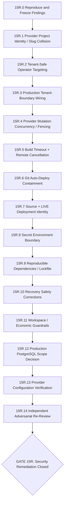

# Node 15R - Pre-Alpha Security Remediation Graph

Status: ACTIVE

Purpose: close the concrete security and lifecycle defects identified independently by the Claude and Astra adversarial reviews before any external customer onboarding.

This is a temporary remediation subgraph under Node 15. It does not broaden V1. It exists to repair confirmed production-path weaknesses, verify provider assumptions, and re-establish a trustworthy external-alpha decision.

## Governing rule

Every remediation node follows the same sequence:

**Reproduce -> prove failure -> smallest fix -> regression test -> real-path verification -> commit**

Do not implement a finding merely because a reviewer recommended it. A finding enters remediation only when it is reproducible from the repository or confirmed by provider configuration.

Do not add infrastructure, abstractions, frameworks, providers, or enterprise tooling unless a confirmed alpha-blocking risk requires it.

**REVENUE EARNS COMPLEXITY.**

## Security evidence rule

A security control receives credit only when production-path enforcement is demonstrated.

The existence of a helper, unit test, evidence packet, or design document is not sufficient. For every claimed control, verify:

1. the production call site exists;
2. the control actually executes on the relevant path;
3. it can fail when presented with invalid or cross-tenant state;
4. its compared values come from independent trust sources where required;
5. regression tests exercise the production path, not only isolated helpers.

## Remediation graph

---

## 15R.0 - Reproduce and Freeze Findings

Objective: turn reviewer findings into a verified remediation backlog before changing production behavior.

Required work:

- reproduce the Claude/Astra cross-tenant Vercel project adoption scenario;
- reproduce ambiguous slug-only mutating operator selection;
- reproduce or falsify duplicate provider creation under concurrent execution;
- reproduce or falsify delete/provision and abandon/build races;
- verify whether build reconciliation can pass with missing provider source identity;
- inspect Git auto-deploy behavior in the actual production path;
- verify the restore-script identity weakness and recovery verifier defects;
- record confirmed, rejected, and provider-dependent findings separately.

Acceptance:

- every P0 has a deterministic reproduction or is explicitly rejected with evidence;
- every P1 is classified as confirmed, provider-dependent, operationally mitigated, or rejected;
- no production mutation is required merely to reproduce code-level defects.

No broad fixes in this node.

---

## 15R.1 - Provider Project Identity / Slug Collision [P0]

Threat:

Two workspaces may legitimately use the same app slug. If provider projects are named and adopted by slug alone, one tenant can bind to another tenant's Vercel project.

Potential impact:

- cross-tenant secret injection;
- wrong code deployed to another tenant's runtime;
- wrong-resource deletion;
- provider state corruption.

Required remediation:

- derive provider project identity from immutable SSC identity, not a tenant-local slug alone;
- make project identity globally collision-resistant within the provider account;
- stamp SSC ownership metadata where provider capability allows;
- verify remote ownership before adopting/reconciling an existing project;
- refuse foreign or ambiguous provider projects loudly;
- audit current runtime bindings before enabling external onboarding;
- enforce local uniqueness of provider project ownership where appropriate.

Acceptance:

- two workspaces can both create an app named `dashboard` without sharing a provider project;
- a foreign/name-colliding project cannot be adopted;
- secret injection and deletion cannot act on a project whose remote identity does not match the intended app/workspace;
- adversarial regression tests exercise the real provisioning path.

---

## 15R.2 - Tenant-Safe Operator Targeting [P0]

Threat:

Mutating operator commands that resolve apps by slug plus `LIMIT 1` can select the wrong workspace when different tenants use common names such as `app`, `api`, `crm`, `portal`, or `dashboard`.

Potential impact:

- secret imported into the wrong tenant;
- wrong app redeployed;
- wrong app deleted;
- downstream tenant checks pass because the wrapper selected the wrong app first.

Required remediation:

- remove slug-only mutating targeting;
- require explicit workspace + app identity for destructive or secret-bearing operations;
- reject ambiguity;
- remove production defaults that silently target a named app;
- preserve convenient read-only lookup only where ambiguity is harmless and explicit.

Acceptance:

- duplicate slugs across workspaces cannot cause a mutating command to select the wrong app;
- delete, redeploy, secret set/import, orchestration, and other mutating wrappers use unambiguous tenant identity;
- tests cover two-workspace same-slug cases through the actual operator entry paths.

---

## 15R.3 - Production Tenant-Boundary Wiring

Objective: ensure tenant-boundary controls protect production paths rather than existing only as tested helpers.

Required remediation:

- enumerate every tenant-boundary assertion and its production callers;
- remove or correct tautological checks;
- compare independently sourced records where a boundary assertion is meant to establish ownership;
- wire provider-resource identity assertions into runtime adoption/reconciliation;
- verify deployment, build, secret, runtime, repository, and provider-operation ownership on the paths that mutate them;
- do not add DB RLS merely for defense-in-depth at founder-operated alpha.

Acceptance:

- every alpha-relevant assertion has a meaningful production caller;
- cross-tenant synthetic records fail in production-path regression tests;
- unused assertions are either intentionally documented as future/self-service controls or removed from claimed alpha evidence.

---

## 15R.4 - Provider Mutation Concurrency / Fencing

Threat:

Concurrent orchestration, retries, deletion, abandonment, or provider creation may race even when local rows are unique.

Required work:

- reproduce Astra's reported duplicate provider-create behavior;
- verify whether multiple workers can concurrently claim one provider operation;
- reproduce delete/provision and abandon/build races;
- distinguish real defects from mock-only artifacts;
- implement the smallest atomic claim/fencing mechanism required for controlled alpha;
- recheck state immediately before committing provider results where an asynchronous provider call creates a race window.

Acceptance:

- one logical provider operation cannot create two provider resources under supported retry/concurrency behavior;
- delete/abandon cannot leave newly created untraceable resources;
- terminal state cannot be overwritten by a stale worker;
- no broad workflow-engine redesign.

---

## 15R.5 - Build Timeout + Remote Cancellation

Threat:

SSC can mark a deployment failed or abandoned while the remote Vercel build continues consuming resources or eventually becomes operational.

Required remediation:

- verify Vercel's supported deployment cancellation mechanism;
- cancel an in-progress provider deployment on timeout and abandonment when safe;
- reconcile the outcome because cancellation may race with completion;
- persist the build deadline from control-plane state rather than resetting it on every orchestrator invocation;
- preserve clear diagnostics for cancellation success, failure, or provider completion-before-cancel.

Acceptance:

- local timeout/abandonment is followed by verified remote containment where provider capability allows;
- repeated cancellation is idempotent;
- no deployment is silently marked stopped when provider execution remains unverified.

---

## 15R.6 - Git Auto-Deploy Containment

Threat:

A linked Git repository may allow provider-side deployments on push, bypassing SSC analysis, policy, accounting, immutable-source controls, and provider-operation ledger.

Required remediation:

- determine the actual Vercel setting/API behavior that disables automatic Git deployment;
- apply it on project creation;
- verify it on adopted/reconciled projects;
- fail or block alpha admission if the invariant cannot be established;
- distinguish provider configuration verification from repository assumptions.

Acceptance:

- a customer Git push cannot create an out-of-band deployment outside SSC orchestration for an alpha-managed project;
- production tests verify the setting helper is actually used in the runtime path.

---

## 15R.7 - Source + LIVE Deployment Identity

Threat:

Reachability and self-submitted metadata may not prove that the canonical URL serves the immutable source commit SSC analysed.

Required remediation:

- require independently observed provider source identity where provider capability supplies it;
- do not treat missing source identity as a verified match;
- freeze and apply build-relevant project/root configuration from the immutable build input;
- verify the canonical production alias/URL resolves to the intended provider deployment before setting `LIVE`;
- preserve explicit `UNKNOWN/UNVERIFIED` states rather than failing open.

Acceptance:

- `LIVE` means SSC has evidence tying source commit, provider deployment, project, and canonical URL together;
- source mismatch or unavailable required identity cannot result in a false verified status.

---

## 15R.8 - Secret Environment Boundary

Threat:

Production secrets currently being applied to preview as well as production increases exposure and may violate the intended V1 environment boundary.

Required work:

- decide the alpha contract: production-only secrets by default, or verified protected preview environments;
- prefer production-only secret injection unless preview is a deliberate supported capability;
- verify no team-level/provider-wide secret inheritance exposes SSC credentials to hostile workloads;
- preserve KMS envelope encryption and current same-app binding protections.

Acceptance:

- alpha workload secrets are injected only into explicitly supported environments;
- no platform/provider credential is inherited into customer workload environments;
- preview behavior is documented and tested rather than accidental.

---

## 15R.9 - Reproducible Dependencies / Lockfile

Threat:

Floating control-plane dependencies can change between deployments and execute with privileged control-plane credentials.

Required remediation:

- commit the control-plane lockfile;
- use reproducible/frozen installation (`npm ci` or equivalent) in operator/Trigger deployment flow;
- keep dependency updates deliberate and reviewable;
- do not add heavy supply-chain tooling for alpha.

Acceptance:

- the same commit resolves the same dependency graph;
- CI/deploy path fails rather than silently rewriting dependency resolution.

---

## 15R.10 - Recovery Safety Corrections

Required work:

- verify/fix disposable restore target identity so production cannot be selected by textual URL variation;
- ensure restore credentials are restricted to a disposable target where practical;
- verify backup checksum before restore;
- correct the restored-secret decrypt verification path and run a safe non-production test-secret decrypt proof;
- make verification commands fail when mandatory checks fail;
- verify required operational tables/schema rather than only selected row counts;
- keep workers/provider reconciliation disconnected until restored state and provider bindings are reviewed.

Acceptance:

- restore cannot target production through an equivalent-but-textually-different connection string;
- backup integrity is checked before restore;
- a controlled restored test secret can be decrypted without printing plaintext;
- failed verification causes a failing process result;
- recovery procedure explicitly fences provider mutation until reconciliation is complete.

---

## 15R.11 - Workspace / Economic Guardrails

Objective: establish the smallest effective founder-operated-alpha consumption boundary.

Required work:

- add an inexpensive workspace-level app/admission cap;
- verify deployment-count/build controls happen before expensive provider mutations where possible;
- move resource policy enforcement before secret injection and later-stage provider work where safe;
- verify provider spend-management/pause behavior and document overshoot limitations;
- set bounded Trigger concurrency if provider/account behavior requires it;
- do not build billing or full metering yet.

Acceptance:

- one tenant cannot multiply per-app limits into an unbounded number of apps/builds under the alpha operating model;
- local policy is not represented as a guarantee that provider spend is stopped unless remote containment is verified;
- founder can stop onboarding or revoke a user without deleting unrelated tenants.

---

## 15R.12 - Production PostgreSQL Scope Decision

Finding:

Customer PostgreSQL provisioning is part of the stated V1 promise, but current reviewer evidence indicates production lifecycle support may still be spike-only.

Required decision:

Choose exactly one before alpha messaging:

A. implement the minimum provider-neutral customer PostgreSQL provisioning path using existing managed-provider architecture; or

B. explicitly remove PostgreSQL provisioning from the controlled-alpha capability promise until implemented.

Do not pretend schema placeholders or spikes are production implementation.

Acceptance:

- product promise and production capability match;
- if implemented, database lifecycle has tenant identity, provisioning, credentials, deletion/retention, reconciliation, and cost boundaries;
- if deferred, alpha scope says so plainly.

---

## 15R.13 - Provider Configuration Verification

Manual verification required after code-level remediation.

### GitHub

- App permissions are least privilege and read-only for required source operations;
- installation scope is explicit;
- no unintended repository/admin/write authority;
- private-key rotation/revocation path understood.

### Vercel

- token/team/project scope and blast radius;
- runtime/project ownership assumptions;
- Git auto-deploy state;
- preview protection/environment behavior;
- customer workload isolation assumptions;
- build cancellation behavior;
- runtime/build limits and spend-management pause/overshoot;
- no team-level SSC credentials inherited by customer projects.

### AWS KMS/IAM

- runtime principal limited to required KMS operations;
- key policy and environment separation;
- no unnecessary admin authority;
- rotation/disable/recovery behavior understood.

### Trigger.dev

- production credential/task scope;
- who can invoke privileged tasks;
- environment/log exposure;
- concurrency controls;
- MFA/minimal membership.

### PostgreSQL/Neon

- runtime DB role versus migration/schema-owner privilege;
- TLS/network exposure;
- control-plane/customer separation;
- PITR/backup settings;
- restore-only credential strategy.

Acceptance:

- every provider-dependent assumption used by alpha security is verified and recorded;
- broad credentials are reduced where the provider supports a practical narrow scope;
- unresolved provider limitations are explicit accepted risks or blockers.

---

## 15R.14 - Independent Adversarial Re-Review

Objective: verify the remediation rather than trust the remediation team.

Required work:

- give the post-remediation repository to at least two independent adversarial reviewers/models;
- do not seed them with the desired conclusion;
- ask them to inspect production call paths and provider-resource identity;
- compare findings;
- reproduce every new P0/P1 before changing code again.

Acceptance:

- no reproducible P0 remains for founder-operated controlled alpha;
- every remaining P1 is either fixed or explicitly constrained by the controlled-alpha operating model;
- provider assumptions have been manually verified;
- no reviewer recommends fundamental infrastructure redesign as necessary for controlled alpha without a concrete attack path.

---

# Gate 15R - Security Remediation Closed

Gate 15R passes only when all of the following are true:

- every confirmed P0 is eliminated;
- every alpha-relevant P1 is fixed or has a documented, enforceable operational mitigation;
- provider project identity is tenant-safe;
- mutating operator targeting is tenant-safe;
- production tenant-boundary controls are meaningfully wired;
- provider mutation concurrency cannot silently duplicate/corrupt state under supported operation;
- timeout/abandonment has verified remote containment where supported;
- customer Git pushes cannot bypass SSC orchestration;
- `LIVE` is bound to the intended source/provider deployment;
- secret environment boundaries match the controlled-alpha contract;
- control-plane dependencies are reproducible;
- recovery cannot accidentally target production and includes a safe decrypt proof;
- workspace/economic guardrails are sufficient for the founder-operated alpha model;
- PostgreSQL capability promise matches actual implementation;
- provider settings/scopes are verified;
- independent adversarial re-review finds no remaining reproducible P0 blocking controlled alpha.

Gate 15R is not permission for public self-service. Customer self-service still requires authenticated principals, membership-derived workspace authorization, rate limiting/abuse controls, replay-safe customer requests, and appropriate tenant-safe external entrypoints.

## Explicit non-goals for this remediation graph

Do not build merely to close Gate 15R:

- Kubernetes;
- custom compute/build sandbox;
- service mesh;
- own servers;
- multi-region control plane;
- generic policy engine;
- WAF/SIEM/enterprise observability;
- public billing/metering;
- new frameworks/providers;
- customer self-service auth/UI;
- custom domains;
- automated destructive orphan cleanup;
- PostgreSQL RLS solely as alpha defense-in-depth.

## Execution starts here

**NEXT_NODE = 15R.0 Reproduce and Freeze Findings**

No remediation code should be written before 15R.0 establishes the confirmed finding set and reproduction evidence.
